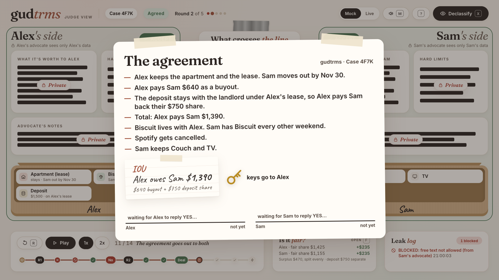
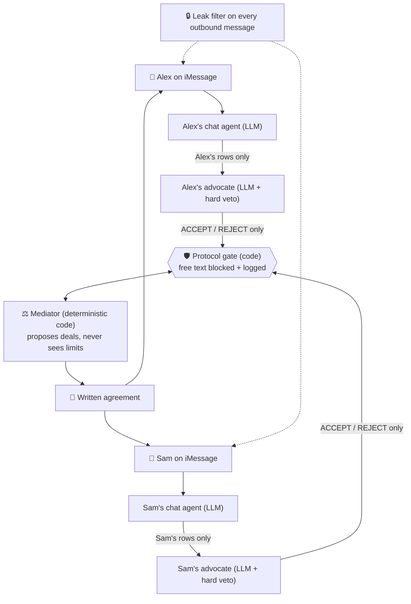
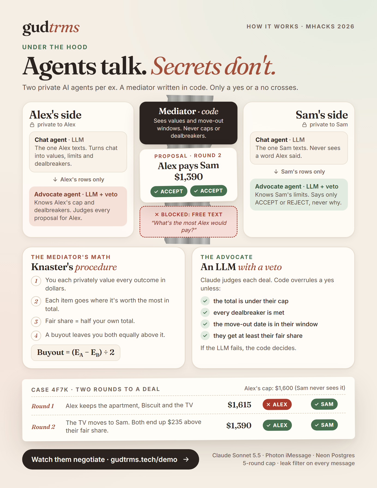

<div align="center">

# 🤝 gud<em>trms</em>

**/ɡʊd tɜːrmz/ · say it like "good terms"**

### Two exes. Two AI advocates. One deal, and nobody's secrets leak.

**An iMessage mediator for breakups, where the agents talk and the secrets don't. Part on gudtrms.**

[**Watch the agents negotiate live →**](https://gudtrms.tech/demo) · [Try it on iMessage](https://gudtrms.tech) · [How it works](#how-it-works) · [Run it yourself](#run-it-in-60-seconds)



<sub>The judge view. Both private sides stay blacked out, and the only thing that ever reaches the middle is the deal.</sub>

*Built at MHacks 2026 in 24 hours.*

</div>

---

## The problem nobody built for

Married couples who split get courts, lawyers and mediators. **26 million Americans live in an unmarried-couple home** and get nothing: just a group chat that turns into a fight over the couch, the lease and who keeps the dog.

<table>
<tr>
<td align="center" width="25%"><h3>59%</h3>of adults 18–44 have lived with a partner they weren't married to<br><sub>Pew, 2019</sub></td>
<td align="center" width="25%"><h3>49%</h3>of couples who move in before marriage split within 5 years<br><sub>CDC / NCHS</sub></td>
<td align="center" width="25%"><h3>$3k–9k</h3>is what divorce mediation costs, and it isn't built for roommates or partners<br><sub>divorce.law, SoFi</sub></td>
<td align="center" width="25%"><h3>29%</h3>of pet owners have split up while sharing a pet<br><sub>MetLife</sub></td>
</tr>
</table>

And the people who most need a neutral go-between are often the ones who can't text each other at all.

## What gudtrms does

The name is the mission: breaking up on **good terms**, even when you can't stand to talk. You text **START** to gudtrms on iMessage. That's it. No app, no account, no group chat with your ex.

1. **You get your own advocate.** Tell it the truth: what the couch is really worth to you, the most you could pay, the dealbreaker you'd never say out loud. It's never shown to your ex. Not by policy, but by how the system is built.
2. **Your ex gets theirs.** gudtrms invites them directly, so you never have to contact them.
3. **The advocates negotiate through a mediator.** It proposes deals. Each advocate answers only **ACCEPT** or **REJECT**, with no reasons, no hints and no free text.
4. **You both get the same written agreement** covering the apartment, the move-out date, the buyout, the deposit, the furniture, the subscriptions and the pet. You each reply YES.

> *"Nothing fits yet. Would you go up to $700? Totally fine to say no. Nobody will know you were asked."*
> If the agents get stuck, each person is privately asked to flex at the same moment, so neither of you is ever the one who blocked the deal.

No lawyers, no shouting match, no "who gets the couch" text thread. 🤝 *Part on gudtrms.*

## Why it's different

Most "AI mediator" ideas put one chatbot in the middle that hears both sides. That is a leak waiting to happen, so gudtrms doesn't do that.

| | A typical LLM mediator | **gudtrms** |
|---|---|---|
| Who sees your secrets | One model that sees everyone | **Only your own agents.** No prompt ever contains both people's private data |
| What the other side hears | Whatever the model decides to say | **ACCEPT or REJECT. Nothing else can cross the wire** |
| Who proposes deals | An LLM improvising | **A deterministic mediator** using fair-division math (Knaster's procedure), so every number is reproducible and explainable |
| What stops an agent going rogue | A system prompt asking it nicely | **A protocol gate in code** that blocks and logs any free-text message. We built a "rogue mode" to prove it |
| What if the LLM misjudges | You hope for the best | **Hard limits the LLM can't override**: payment cap, dealbreakers, move-out window, fair share |
| What if the LLM goes down | The product stalls | **Falls back to the rule engine.** A negotiation never hangs |

**The agents are smart. The wire is dumb. That is the whole idea.** Intelligence lives where judgment is needed (understanding people, weighing a proposal). Anything that has to be fair or provable (the proposals, the limits, what crosses between sides) is plain code you can read and test.

### Watch it protect someone

Our demo couple, Alex and Sam, split a lease, a dog named Biscuit, a couch and a TV. Alex can pay at most $1,600 in total. Sam never learns that.

| Round | Proposal | Total | Alex's advocate | Sam's advocate |
|---|---|---|---|---|
| 1 | Alex keeps the apartment, Biscuit and the TV | $1,615 | ❌ **REJECT** (over a limit Sam can't see) | ✅ ACCEPT |
| 2 | The TV moves to Sam | **$1,390** | ✅ ACCEPT | ✅ ACCEPT |

Two rounds, one deal, and both end up exactly **$235 above their fair share**. Sam never learned why round 1 failed. Parted on gudtrms. Open the [live judge view](https://gudtrms.tech/demo) and flip the **X-ray toggle**: each advocate's private reasoning appears on the sides, and the only thing in the middle is what actually crossed.

Turn on **rogue mode** and one advocate tries to ask "what's the most Alex would pay?". The gate blocks it, logs the attempt (never the content), and the middle lane flashes red.

## How it works



<div align="center">

</div>

- **Six agents per case.** Each person gets two LLM agents (a chat agent they text and an advocate that negotiates), each in its own isolated context. The mediator and the wire are code.
- **Privacy by construction.** Every model call is built from one person's data only, and the code that assembles it throws if it ever sees the other side's.
- **A leak filter on every message out.** It checks for the other person's numbers and dates, and a second LLM pass checks that replies don't hint at what the other person said.
- **Fair, explainable math.** Each person values every outcome in dollars. Items go where they're worth the most in total, and a buyout leaves both people equally above their fair share. The judge view's math panel shows exactly why the buyout is what it is.
- **Capped, so it can't be used to probe.** Five rounds, then the case moves to private relaxation.
- **Built to be safe to invite someone into.** One invite per case, fixed text, no reminders, and `STOP` blocks that number from every future case.

## Built with

<p>


</p>

- **Claude** (via the Anthropic SDK, behind a small provider interface) for the chat agents, advocates and leak checker. No agent framework: plain modules and tool calls.
- **Photon Spectrum** for iMessage, with a terminal provider for local development.
- **Neon** (hosted Postgres) holds every case. The judge view reads it read-only.
- **Docker Compose + Caddy** on AWS Lightsail run the bot, landing page and judge view.

## Run it in 60 seconds

You don't need an iPhone: the terminal provider lets you play both exes in your console.

**Prerequisites:** Node.js 22.9 or newer, a free [Neon](https://neon.tech) database, and an [Anthropic API key](https://console.anthropic.com).

```bash
git clone https://github.com/PRANAVMAHALINGAM/gudtrms.git
cd gudtrms
npm install
cp .env.example .env     # add DATABASE_URL and ANTHROPIC_API_KEY
npm run db:reset         # creates the tables and loads the Alex & Sam demo case
npm run demo:negotiate   # watch round 1 REJECT and round 2 land the deal
```

Then see it the way a judge would:

```bash
npm run judge:install && npm run judge   # the three-lane judge view, with the X-ray toggle
ROGUE_MODE=B npm run demo:agreement      # an advocate tries to leak, and the gate blocks it
npm test                                 # 59 tests, including the demo rounds to the dollar
```

Prefer containers? `docker compose up -d --build`, plus `--profile judge` for the judge view at http://localhost:8080/demo. More in [`docs/DOCKER.md`](docs/DOCKER.md). For real iMessage, set `MESSAGING_PROVIDER=imessage` and add your two Photon Spectrum keys to `.env`.

## Accomplishments we're proud of

- **A privacy promise we can prove,** not just state: a rogue-mode demo, a protocol gate, and a judge view that shows what each side knows next to what actually crossed.
- **LLM agents with real teeth and a real leash.** They bring judgment, such as honoring a soft preference like "I don't want handoffs with them", but can never overrule a hard limit.
- **A mediator that is both fair and boring on purpose.** Deterministic, tested, and reproduces the demo's two rounds exactly.
- **It's cheap enough to be real.** A whole case costs well under $1 in AI. We measured about **$0.30** for a full run (46 Claude calls: both intakes, the leak filter on every reply, the negotiation, and a "NO" that sent the deal back to the table and re-negotiated). Every call is logged per case with `npm run usage -- <code>`.
- **It's live.** Hosted on AWS with HTTPS, answering on real iMessage, built and shipped in 24 hours.

## Honest limits

- **Not legal advice, not a binding contract, and no payments.** The agreement says who owes whom. You settle it yourselves.
- **Scope for v1:** exactly two people who lived together and are splitting up. No marriage, kids, mortgages or co-owned property.
- **iPhone only.** It runs on iMessage.
- **Inviting your ex needs a dedicated line.** On our Photon plan, gudtrms can only text people who have already signed up and texted the line once. Photon's Business plan removes that limit and lets gudtrms reach your ex even if they've blocked you. For the demo, every phone signs up first.

## What's next

- A dedicated iMessage line so gudtrms can invite an ex who has blocked you.
- Android support, if an iMessage line can fall back to SMS/RCS.
- Row-level security in Neon and a sandboxed demo-data branch for the judge view.
- A 50/50 pet-custody option in the negotiation (specced, not built yet).

## Team

| | |
|---|---|
| **Pranav Mahalingam** ([@PRANAVMAHALINGAM](https://github.com/PRANAVMAHALINGAM)) | The conversation side: iMessage, router, chat agents, leak filter, landing page, Docker and hosting |
| **Shruti Jayaraman** ([@shrujaya](https://github.com/shrujaya)) | The negotiation side: mediator, advocate agents, protocol gate, database, judge view |

<div align="center">

### 🤝 Part on gudtrms.

*gudtrms = "good terms"*

</div>

---

## For contributors

The spec, work split and rules are in [`AGENTS.md`](AGENTS.md). Log every change in [`docs/CHANGELOG.md`](docs/CHANGELOG.md).

| Path | What |
|---|---|
| `src/shared/` | Types, the contract (`negotiate`, `sendTo`), demo scenario data |
| `src/engine/` | Mediator, advocate agents, `negotiate()`, protocol gate (rogue mode) |
| `src/intake/` | The chat agent: intake, soft preferences, relaxation |
| `src/conversation/` | Agreement text, YES / NO confirmation, relaxation prompts |
| `src/privacy/` | `sendTo` and the leak filter |
| `src/router/`, `src/messaging/` | Keyword × case-state routing and Photon Spectrum |
| `src/llm/` | Provider interface and Claude, with per-case usage and cost |
| `db/`, `src/db/` | Neon schema, seed and client |
| `judge/` | The judge view: mock (real engine in the browser) and live (Neon) |
| `site/`, `src/site/` | Landing page and sign-up |
| `deploy/`, `docs/DOCKER.md` | Caddy config and the hosting guide |
